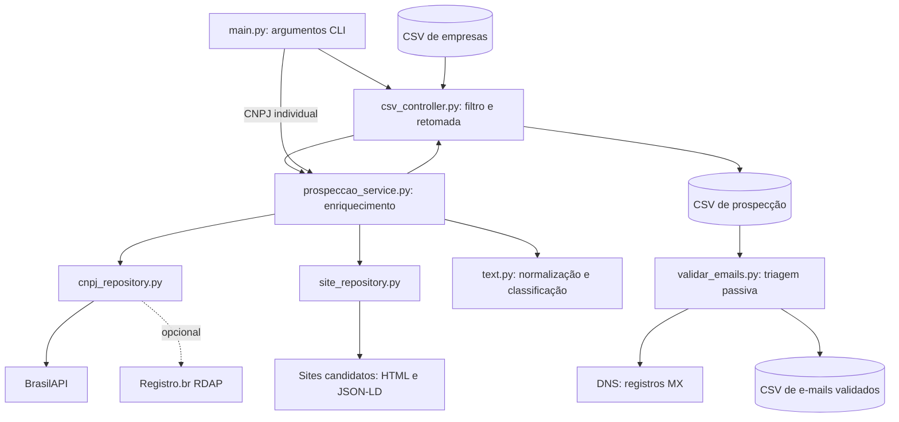

# Enrich CNPJ

Pipeline em Python para enriquecer uma base de empresas com dados cadastrais, nomes de sócios, domínios candidatos e e-mails públicos de contato. A entrada é um CSV preparado a partir dos dados da Receita Federal; a saída é outro CSV, com um registro por CNPJ processado.

O foco padrão é **empresas do estado de São Paulo (UF = SP), ativas e matrizes**. O projeto ajuda a localizar contatos comerciais, mas não comprova que um endereço pertence a um sócio ou responsável específico.

## O que o projeto faz

- Filtra empresas pela UF antes das consultas externas.
- Descarta CNPJs repetidos e retoma lotes usando a saída existente.
- Consulta a BrasilAPI para obter dados cadastrais e nomes do quadro de sócios e administradores (QSA).
- Aproveita e-mails do CSV e do cadastro retornado pela API.
- Procura sites usando domínios corporativos dos e-mails ou candidatos derivados do nome da empresa; opcionalmente, consulta RDAP do Registro.br.
- Extrai contatos publicados nas páginas, separa e-mails corporativos e genéricos e escolhe um contato prioritário por regras heurísticas.
- Reutiliza em memória resultados de até 50 mil domínios para não minerar repetidamente o mesmo site durante uma execução.
- Oferece uma etapa independente de validação passiva de e-mails por sintaxe, DNS e listas locais.

Não há interface web, banco de dados ou envio de mensagens. A operação ocorre pelo terminal e os arquivos CSV armazenam os resultados.

## Arquitetura

A aplicação separa a entrada por linha de comando, o controle do lote, as regras de prospecção e o acesso às fontes externas.



### Responsabilidades dos módulos

- **`main.py`**: interpreta os argumentos e escolhe entre processamento de CSV e consulta individual.
- **`app/controllers/csv_controller.py`**: lê a entrada, aplica os filtros, elimina duplicatas, identifica CNPJs já processados, coordena threads e grava os resultados.
- **`app/services/prospeccao_service.py`**: combina cadastro, domínios e e-mails; define o contato prioritário, a classificação e as observações.
- **`app/repositories/cnpj_repository.py`**: integra BrasilAPI e RDAP, com tratamento de falhas e limites de acesso.
- **`app/repositories/site_repository.py`**: verifica sites, visita páginas e extrai e-mails de texto, links `mailto:` e campos `email` de JSON-LD.
- **`app/utils/text.py`**: normaliza CNPJs, valida sintaxe de e-mails, gera domínios candidatos e pontua contatos.
- **`app/config.py`**: centraliza sessões HTTP por thread, timeouts, logs e regras de extração.
- **`validar_emails.py`**: executa a validação passiva em uma etapa separada da prospecção.

### Estrutura do repositório

```text
.
├── main.py
├── app/
│   ├── config.py
│   ├── controllers/csv_controller.py
│   ├── services/prospeccao_service.py
│   ├── repositories/
│   │   ├── cnpj_repository.py
│   │   └── site_repository.py
│   └── utils/text.py
├── csv_input/                       # Bases locais de entrada
├── tests/test_prospeccao.py          # Testes com integrações simuladas
├── validar_emails.py
├── requirements-email-validation.txt
├── disposable_domains.txt
├── email_suppressions.csv           # Lista local de supressão
├── knock_registro_api.py            # Diagnóstico manual de acesso HTTP
├── README.md
└── README_validacao_emails.md
```

## Fluxo de processamento

1. **Selecionar empresas:** o leitor aceita CSV separado por vírgulas, normaliza os cabeçalhos e seleciona a UF solicitada, situação `ATIVA` e tipo `MATRIZ`.
2. **Preparar o lote:** normaliza os CNPJs para 14 dígitos, remove duplicatas e exclui os já encontrados na saída. `--limit` é aplicado aos novos registros elegíveis.
3. **Consultar o cadastro:** busca dados na BrasilAPI, incluindo razão social, nome fantasia, QSA e e-mail cadastral. Dados de nome fornecidos no CSV têm preferência.
4. **Identificar domínios:** tenta RDAP quando habilitado; na ausência de domínios, usa os e-mails corporativos do cadastro/CSV; como alternativa, testa nomes de domínio derivados da empresa.
5. **Buscar contatos:** visita os domínios selecionados, prioriza links reais de contato e usa caminhos conhecidos como alternativa. O limite padrão é de oito páginas por domínio, além das requisições de descoberta do site.
6. **Classificar:** combina e-mails encontrados e cadastrais, separa corporativos de genéricos e pontua contatos. A pontuação favorece o domínio de referência e termos como vendas e comercial.
7. **Persistir:** grava cada resultado assim que termina. Com workers paralelos, a saída pode ter ordem diferente da entrada. Falhas são registradas em `obs`.
8. **Validar, opcionalmente:** o script independente verifica sintaxe e MX, aplica supressões e sinaliza domínios descartáveis.

O lote trabalha em fluxo: não carrega todos os registros elegíveis nem cria milhões de tarefas antecipadamente. A fila mantém no máximo duas tarefas por worker, grava resultados conforme terminam e informa a velocidade periodicamente. Assim, o consumo de memória das tarefas permanece aproximadamente constante conforme a entrada cresce.

Na base atual, a varredura das 4.753.435 linhas levou cerca de 14 segundos e encontrou 346.159 matrizes ativas em SP. A parte demorada são as consultas externas por empresa e por site. Mesmo com paralelismo e cache, processar todo esse conjunto é uma tarefa longa; faça primeiro um lote de medição e estime o prazo pela taxa exibida no log.

## Instalação

Use Python 3.9 ou superior. Os testes das melhorias foram executados com Python 3.12.

No PowerShell, dentro da pasta do projeto:

```powershell
python -m venv .venv
.\.venv\Scripts\python.exe -m pip install -r requirements.txt
```

O arquivo também instala a dependência da validação passiva (`dnspython`). Os exemplos abaixo usam diretamente o Python do ambiente virtual, sem exigir sua ativação.

O enriquecimento precisa de acesso à internet para consultar APIs e sites. A validação passiva precisa de acesso ao DNS.

## Formato da entrada

O projeto espera um **CSV já preparado com cabeçalho**, em UTF-8, com ou sem BOM, separado por vírgulas. Não importa diretamente os arquivos brutos distribuídos pela Receita Federal nem arquivos Excel `.xlsx`.

Campos usados:

- **`CNPJ_COMPLETO` ou `CNPJ`**: CNPJ completo; mantenha como texto para preservar zeros à esquerda.
- **`UF`**: sigla do estado; obrigatória para o filtro geográfico.
- **`SITUACAO_CADASTRAL`**: o lote aceita o valor textual `ATIVA`.
- **`MATRIZ_FILIAL`**: o lote aceita o valor textual `MATRIZ`.
- **`EMAIL`**: opcional; pode conter múltiplos endereços separados por ponto e vírgula.
- **`NOME_FANTASIA` e `RAZAO_SOCIAL`**: opcionais; ajudam na identificação da empresa e na busca de domínios.

Exemplo de estrutura, com dados ilustrativos:

```csv
CNPJ_COMPLETO,MATRIZ_FILIAL,NOME_FANTASIA,SITUACAO_CADASTRAL,UF,EMAIL
00123456000100,MATRIZ,Empresa Ilustrativa,ATIVA,SP,
```

Cabeçalhos em minúsculas também são aceitos. Valores de UF aceitam espaços externos e letras minúsculas. Registros sem UF ou com UF diferente são descartados; a ausência da coluna `UF` gera erro. A ausência dos valores exigidos de situação e matriz impede a seleção da linha.

## Como executar

### Primeiro lote de São Paulo

```powershell
.\.venv\Scripts\python.exe main.py --input-csv csv_input/BASE_TOTAL_ESTABELECIMENTOS_RECEITA.csv --limit 100 --workers 3
```

A saída padrão é `prospeccao_resultados_sp.csv`. O filtro cobre todo o **estado**, não apenas o município de São Paulo.

Para medir a infraestrutura antes do lote completo, comece com 1.000 empresas e 10 workers:

```powershell
.\.venv\Scripts\python.exe main.py --input-csv csv_input/BASE_TOTAL_ESTABELECIMENTOS_RECEITA.csv --uf SP --output-csv prospeccao_sp_v2.csv --limit 1000 --workers 10 --progress-every 100
```

Se os logs mostrarem muitos HTTP 429, reduza os workers. Quando o lote terminar, execute novamente sem `--limit`; o arquivo de saída será retomado e os 1.000 CNPJs já gravados serão ignorados.

### Definir saída ou outro estado

```powershell
.\.venv\Scripts\python.exe main.py --input-csv csv_input/BASE_TOTAL_ESTABELECIMENTOS_RECEITA.csv --uf SP --output-csv contatos_sp_nova_busca.csv --limit 100
.\.venv\Scripts\python.exe main.py --input-csv csv_input/BASE_TOTAL_ESTABELECIMENTOS_RECEITA.csv --uf RJ --limit 100
```

### Consultar um CNPJ individual

```powershell
.\.venv\Scripts\python.exe main.py --cnpj SEU_CNPJ_DE_14_DIGITOS
```

Substitua o marcador pelo CNPJ desejado. Nesse modo, o resultado aparece no terminal; não há filtro por UF, situação ou matriz, nem gravação automática em CSV. Quando `--input-csv` é informado, o processamento do lote tem prioridade sobre `--cnpj`.

### Argumentos do lote

- `--input-csv`: caminho do CSV de entrada.
- `--output-csv`: caminho da saída; padrão `prospeccao_resultados_<uf>.csv`.
- `--uf`: sigla do estado; padrão `SP`.
- `--limit`: quantidade de novos CNPJs elegíveis a processar. Use um inteiro positivo; omitido, processa todos os elegíveis ainda não registrados.
- `--workers`: número de threads; padrão da CLI é `1`. Valores maiores permitem consultas simultâneas e aumentam a carga nas fontes externas.
- `--progress-every`: intervalo do log de progresso; padrão `100`. Use `0` para desabilitar.

## Resultado e retomada

O CSV de saída contém:

- **Identificação:** `cnpj`, `razao_social`, `nome_fantasia`.
- **Sócios:** `decisores_qsa`, com nomes retornados pelo QSA. O nome da coluna não representa uma verificação de poder de decisão.
- **Domínios:** `dominios` e `origem_dominios`.
- **Contatos:** `emails_base` (valor original do CSV), `emails_encontrados`, `emails_corporativos` e `emails_genericos`. E-mails da API entram no conjunto encontrado.
- **Priorização:** `email_prioritario`, `tipo_email_prioritario` e `confianca_email`.
- **Rastreabilidade:** `origem_emails` e `obs`, com indicação geral de fontes e falhas. Não há URL de evidência individual para cada e-mail.

Listas dentro de uma célula usam ponto e vírgula. A confiança é heurística, não uma probabilidade nem confirmação de entregabilidade. Contatos obtidos exclusivamente de sites derivados do nome recebem confiança baixa; contatos corporativos cadastrais ou obtidos nos demais sites recebem confiança média na implementação atual.

Ao executar novamente com a mesma saída, os CNPJs já registrados são ignorados, inclusive aqueles cuja linha contém erro. Para repetir a busca com novas regras ou tentar novamente falhas, use outro arquivo de saída.

**O filtro de UF vale para a seleção da entrada; ele não limpa resultados antigos.** Não reutilize uma saída de vários estados se precisa de um arquivo exclusivo de SP.

A gravação usa um marcador `<saida>.writing`, removido ao finalizar. O marcador permite que o validador aguarde a conclusão; não é um bloqueio para duas execuções de enriquecimento. Execute apenas um processo de prospecção por arquivo de saída. Após encerramento abrupto, um marcador pode permanecer: confirme que o processo terminou antes de removê-lo.

## Configuração HTTP

As opções são lidas em `app/config.py` durante a importação:

- `ENRIQUECER_CONNECT_TIMEOUT`: timeout de conexão em segundos; padrão `5`.
- `ENRIQUECER_READ_TIMEOUT`: timeout de leitura em segundos; padrão `15`.
- `ENRIQUECER_ENABLE_RDAP`: habilita RDAP com `1`, `true` ou `yes`; desabilitado por padrão.
- `ENRIQUECER_USER_AGENT`: identificação enviada nas requisições HTTP.

Defina as variáveis antes de iniciar o processo:

```powershell
$env:ENRIQUECER_CONNECT_TIMEOUT = "5"
$env:ENRIQUECER_READ_TIMEOUT = "15"
$env:ENRIQUECER_ENABLE_RDAP = "0"
.\.venv\Scripts\python.exe main.py --input-csv csv_input/BASE_TOTAL_ESTABELECIMENTOS_RECEITA.csv --limit 10
```

O `.env` é carregado antes da configuração da aplicação, portanto essas opções podem ser mantidas no arquivo.

As sessões HTTP são separadas por thread e não fazem retries automáticos. Respostas 403/429 e timeouts são registradas nos logs. O RDAP é interrompido pelo restante da execução se retornar 403 ou 429. Não há fila persistente nem controle global de taxa entre workers.

## Validação passiva dos e-mails

Depois da prospecção:

```powershell
.\.venv\Scripts\python.exe validar_emails.py --input-csv prospeccao_resultados_sp.csv --output-csv emails_validados.csv --suppressions email_suppressions.csv --disposable-domains disposable_domains.txt --workers 4
```

O validador deduplica endereços, verifica sintaxe e registros MX e aplica as listas locais. Aguarda o marcador de escrita desaparecer e o arquivo ficar estável antes de criar um snapshot. Ele processa esse snapshot uma vez, sem acompanhar linhas posteriores.

A validação não envia mensagens e não confirma a existência de uma caixa individual. Consulte [README_validacao_emails.md](README_validacao_emails.md) para os status de saída e detalhes das listas de supressão.

## Testes

```powershell
.\.venv\Scripts\python.exe -m unittest discover -s tests -v
```

Os testes atuais simulam as integrações externas e verificam:

- filtro por SP antes do limite e das consultas, além da rejeição de CSV sem UF;
- extração de múltiplos destinatários `mailto:` e contatos em JSON-LD;
- prioridade de links reais de contato dentro do limite de páginas;
- aproveitamento do e-mail da API e busca em múltiplos domínios corporativos.

Eles não medem a taxa de aquisição de e-mails na base real nem a disponibilidade das fontes externas.

## Limitações atuais

- Um domínio derivado do nome pode pertencer a outra empresa; não há confirmação automática do vínculo com o CNPJ.
- Um domínio de e-mail cadastral pode ser de uma contabilidade ou outro prestador. A classificação corporativa não prova titularidade.
- O QSA fornece nomes, mas o projeto não relaciona cada e-mail a uma pessoa específica.
- A busca processa HTML retornado pelo servidor; não executa JavaScript nem interage com formulários.
- A identificação de CNPJ exige 14 dígitos e não calcula os dígitos verificadores.
- O conjunto de CNPJs já processados fica em memória para permitir retomada rápida; a entrada e as tarefas são processadas em fluxo.
- Não há cache persistente de consultas por domínio, garantia de site encontrado ou garantia de entrega de e-mail.
